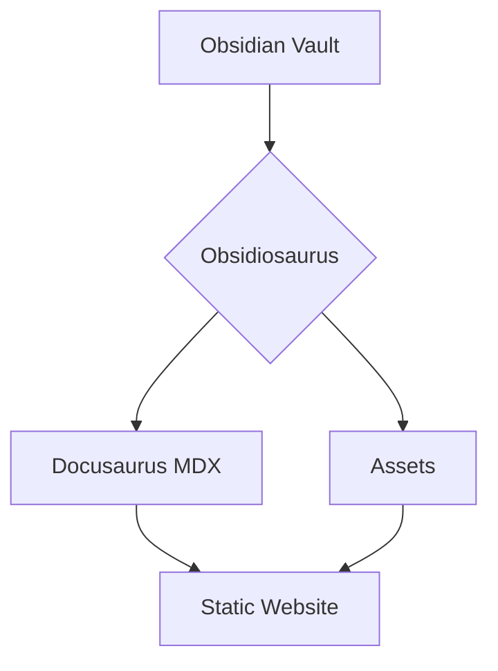
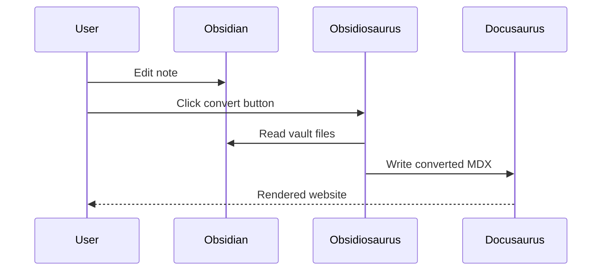
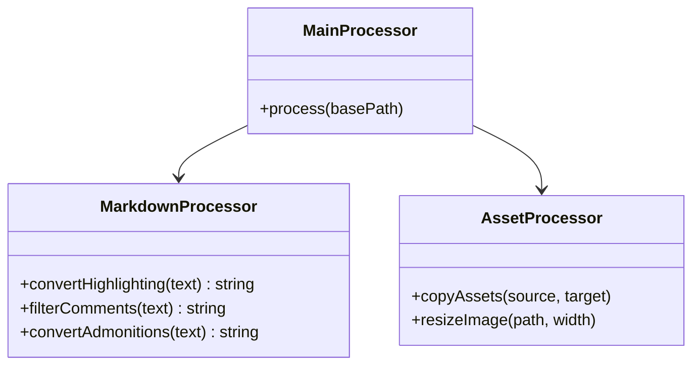
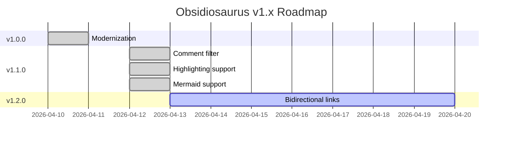
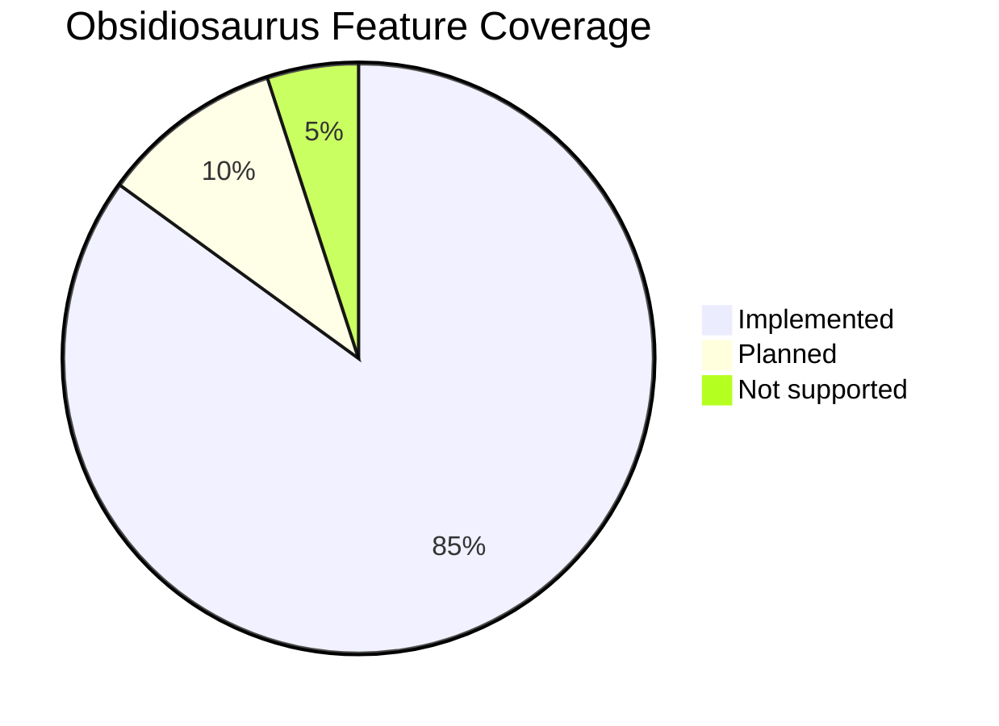

# Formatting Showcase

This page demonstrates every formatting feature supported by Obsidiosaurus v1.1.0.

---

## Text Formatting

**Bold text** — `**text**`

*Italic text* — `*text*` or `_text_`

***Bold and italic*** — `***text***`

~~Strikethrough~~ — `~~text~~`

Highlighting: ==Highlighted text== — syntax `==text==` (converted to `<mark>`)

`Inline code` — `` `code` ``

---

## Headings

# H1 — Document Title
## H2 — Section
### H3 — Subsection
#### H4 — Detail
##### H5 — Fine detail
###### H6 — Finest level

---

## Links

[External link](https://docusaurus.io)

[[formatting_showcase__en|Internal Obsidian link]]

---

## Lists

### Unordered
- Item A
- Item B
  - Nested item
  - Another nested
    - Third level
- Item C

### Ordered
1. First
2. Second
   1. Nested ordered
   2. Another
3. Third

### Task list
- [ ] Open task
- [x] Completed task
- [ ] Another open task

---

## Blockquote

> This is a standard blockquote.
> It can span multiple lines.

---

## Callouts / Admonitions

>[!note] Note
>General information worth highlighting.

>[!tip] Tip
>A helpful hint or best practice.

>[!info] Info
>Additional background context.

>[!warning] Warning
>Something the user should be cautious about.

>[!danger] Danger
>A critical warning — potential for data loss or breaking changes.

>[!caution] Caution
>Proceed carefully.

>[!quote] Quote
>*"The best documentation is the one that gets written."*

---

## Tables

| Feature         | Obsidian | Docusaurus | Status |
|-----------------|----------|------------|--------|
| Bold / Italic   | ✅       | ✅         | Native |
| Highlighting    | ✅       | ✅         | Converted |
| Mermaid         | ✅       | ✅         | Plugin |
| Comments        | ✅       | filtered   | Removed |
| Footnotes       | ✅       | ✅         | Native |
| Tasks           | ✅       | ✅         | Native |

---

## Code Blocks

### Inline

Use `npm run build` to build the project.

### Block (with syntax highlighting)

```typescript
function greet(name: string): string {
  return `Hello, ${name}!`;
}

console.log(greet("Obsidiosaurus"));
```

```python
def convert_markdown(source: str) -> str:
    """Convert Obsidian markdown to Docusaurus format."""
    return source.replace("==", "<mark>")
```

```bash
# Run Obsidiosaurus conversion
npx obsidiosaurus convert --vault ./vault --output ./website
```

---

## Diagrams (Mermaid)

Requires `@docusaurus/theme-mermaid` — configured in `docusaurus.config.js`:
```js
themes: ['@docusaurus/theme-mermaid'],
markdown: { mermaid: true }
```

### Flowchart



### Sequence Diagram



### Class Diagram



### Gantt Chart



### Pie Chart



---

## Math Equations

Inline math: $E = mc^2$

Block equation:

$$
\int_{-\infty}^{\infty} e^{-x^2} dx = \sqrt{\pi}
$$

$$
\frac{\partial f}{\partial x} = \lim_{h \to 0} \frac{f(x+h) - f(x)}{h}
$$

---

## Footnotes

Obsidiosaurus supports standard markdown footnotes.[^1]

They render natively in Docusaurus MDX.[^2]

[^1]: Footnotes appear at the bottom of the page automatically.
[^2]: No special conversion needed — MDX handles them out of the box.

---

## Horizontal Rules

Content above

---

Content below

---

## Comments (Obsidian-only)

Comments are written with `%% ... %%` and are **removed during conversion** — they never appear on the website.

Inline syntax:
```
%% This is an inline comment %%
```

Block syntax:
```
%%
This is a
multi-line comment
%%
```

%% Inline comment — this text is removed %%

The text above is an inline comment in Obsidian. It is not visible here.

%% 
Block comment — this is also removed:
- line one
- line two
%%

The text above is a block comment in Obsidian. It is also not visible here.

---

## Images

Obsidiosaurus converts images to `.webp` and handles resizing automatically.

### Standard image
![[obsidiosaurus_sidebar_icon.png]]

### Resized image (400px width)
![[obsidiosaurus_run_sucess_notifaction_2.png|400]]

---

## iFrames

Embed external content directly:

<iframe src="https://docusaurus.io" width="100%" height="400px" />
