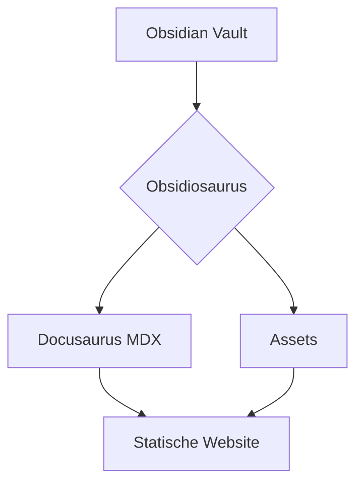
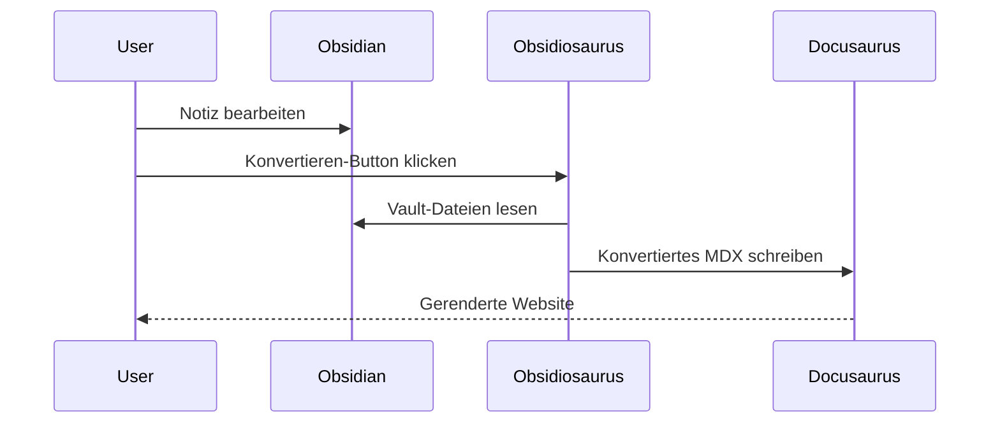
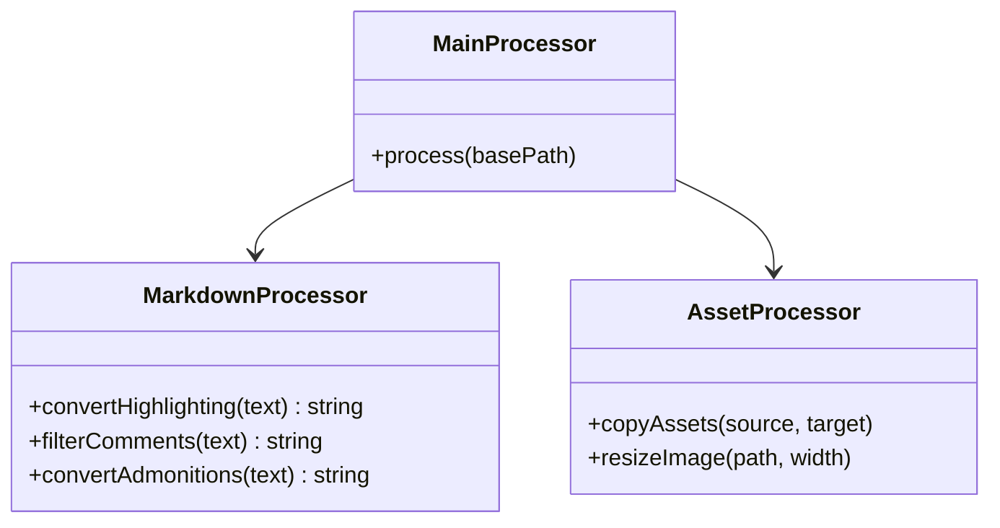
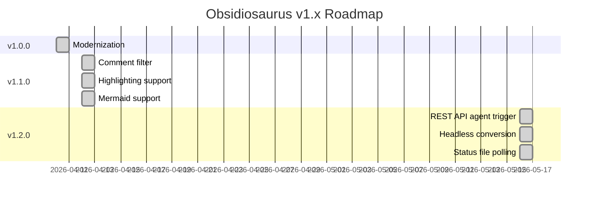
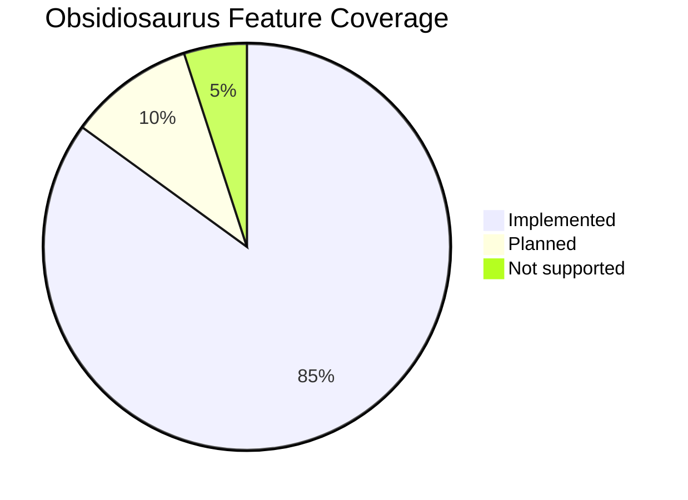

# Formatierungs-Showcase

Diese Seite zeigt alle Formatierungs-Funktionen, die Obsidiosaurus v1.2.0 unterstützt.

---

## Textformatierung

**Fetter Text** — `**text**`

*Kursiver Text* — `*text*` oder `_text_`

***Fett und kursiv*** — `***text***`

~~Durchgestrichen~~ — `~~text~~`

Highlighting: <mark>Hervorgehobener Text</mark> — Syntax `<mark>text</mark>` (wird zu `<mark>`)

`Inline-Code` — `` `code` ``

---

## Überschriften

# H1 — Dokumenttitel
## H2 — Sektion
### H3 — Unterabschnitt
#### H4 — Detail
##### H5 — Feindetail
###### H6 — Feinste Ebene

---

## Links

[Externer Link](https://docusaurus.io)

[[formatting_showcase__de|Interner Obsidian-Link]]

---

## Listen

### Ungeordnet
- Punkt A
- Punkt B
  - Verschachtelter Punkt
  - Noch einer
    - Dritte Ebene
- Punkt C

### Geordnet
1. Erstens
2. Zweitens
   1. Verschachtelt geordnet
   2. Noch einer
3. Drittens

### Aufgabenliste
- [ ] Offene Aufgabe
- [x] Erledigte Aufgabe
- [ ] Weitere offene Aufgabe

---

## Blockquote

> Das ist ein normales Blockquote.
> Es kann sich über mehrere Zeilen erstrecken.

---

## Callouts / Admonitions

:::note[Hinweis]

Allgemeine Information, die hervorgehoben werden sollte.
:::

:::tip[Tipp]

Ein hilfreicher Hinweis oder eine Best Practice.
:::

:::info[Info]

Zusätzlicher Hintergrund-Kontext.
:::

:::warning[Warnung]

Etwas, bei dem der Nutzer vorsichtig sein sollte.
:::

:::danger[Achtung]

Eine kritische Warnung — Datenverlust oder Breaking Changes möglich.
:::

:::caution[Vorsicht]

Mit Bedacht vorgehen.
:::


>*„Die beste Dokumentation ist die, die tatsächlich geschrieben wird."*
>
> — Zitat

---

## Tabellen

| Feature         | Obsidian | Docusaurus | Status |
|-----------------|----------|------------|--------|
| Fett / Kursiv   | ✅       | ✅         | Nativ |
| Highlighting    | ✅       | ✅         | Konvertiert |
| Mermaid         | ✅       | ✅         | Plugin |
| Kommentare      | ✅       | gefiltert  | Entfernt |
| Fußnoten        | ✅       | ✅         | Nativ |
| Aufgaben        | ✅       | ✅         | Nativ |

---

## Codeblöcke

### Inline

Nutze `npm run build`, um das Projekt zu bauen.

### Block (mit Syntax-Highlighting)

```typescript
function greet(name: string): string {
  return `Hello, ${name}!`;
}

console.log(greet("Obsidiosaurus"));
```

```python
def convert_markdown(source: str) -> str:
    """Konvertiert Obsidian-Markdown ins Docusaurus-Format."""
    return source.replace("==", "<mark>")
```

```bash
# Obsidiosaurus-Konvertierung ausführen
npx obsidiosaurus convert --vault ./vault --output ./website
```

---

## Diagramme (Mermaid)

Benötigt `@docusaurus/theme-mermaid` — konfiguriert in `docusaurus.config.js`:
```js
themes: ['@docusaurus/theme-mermaid'],
markdown: { mermaid: true }
```

### Flussdiagramm



### Sequenzdiagramm



### Klassendiagramm



### Gantt-Diagramm



### Tortendiagramm



---

## Mathematische Gleichungen

Inline-Mathe: $E = mc^2$

Block-Gleichung:

$$
\int_{-\infty}^{\infty} e^{-x^2} dx = \sqrt{\pi}
$$

$$
\frac{\partial f}{\partial x} = \lim_{h \to 0} \frac{f(x+h) - f(x)}{h}
$$

---

## Fußnoten

Obsidiosaurus unterstützt Standard-Markdown-Fußnoten.[^1]

Sie werden in Docusaurus-MDX nativ gerendert.[^2]

[^1]: Fußnoten erscheinen automatisch am Ende der Seite.
[^2]: Keine spezielle Konvertierung nötig — MDX rendert sie out-of-the-box.

---

## Horizontale Linien

Inhalt darüber

---

Inhalt darunter

---

## Kommentare (nur Obsidian)

Kommentare werden mit `` geschrieben und **bei der Konvertierung entfernt** — sie erscheinen nie auf der Website.

Inline-Syntax:
```
```

Block-Syntax:
```
```


Der Text oben ist ein Inline-Kommentar in Obsidian. Er ist hier nicht sichtbar.


Der Text oben ist ein Block-Kommentar in Obsidian. Auch er ist hier nicht sichtbar.

---

## Bilder

Obsidiosaurus konvertiert Bilder zu `.webp` und übernimmt die Größenänderung automatisch.

### Standard-Bild
![[obsidiosaurus_sidebar_icon.png]]

### Skaliertes Bild (400px Breite)
![[obsidiosaurus_run_sucess_notifaction_2.png|400]]

---

## iFrames

Externe Inhalte direkt einbetten:

<iframe src="https://docusaurus.io" width="100%" height="400px" />
